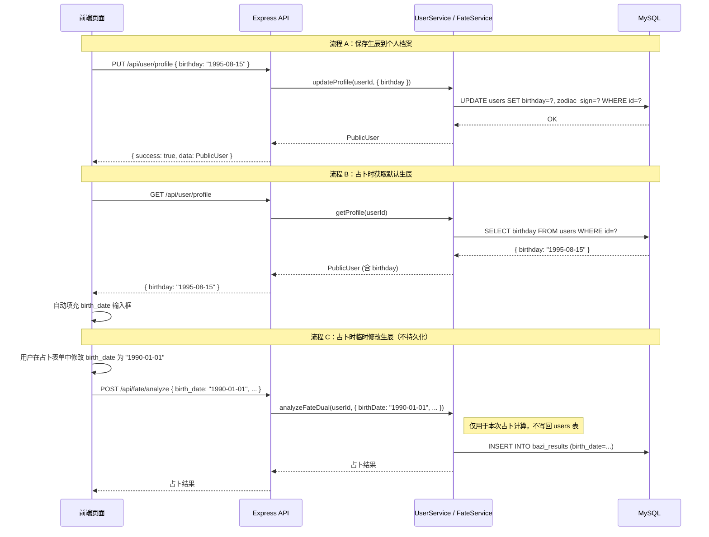

# 设计文档：个人档案/生辰信息 (user-birth-profile)

## 概述

为占卜应用添加「个人生辰档案」功能。用户可在个人资料页保存出生日期（birthday），占卜页面（如命运双盘）默认自动填充已保存的生辰，同时允许用户在占卜时临时修改出生日期而不影响档案中的持久化值。

## 主要工作流



## 核心接口/类型

```typescript
// === 已有类型（无需修改） ===

// tarot-server/src/types/index.ts - DbUser 已包含 birthday 字段
interface DbUser {
  // ... 其他字段
  birthday: string | null;       // DATE 类型，格式 YYYY-MM-DD
  zodiac_sign: string | null;    // 自动根据 birthday 计算
  // ...
}

// tarot-server/src/types/index.ts - PublicUser 已包含 birthday 字段
interface PublicUser {
  // ... 其他字段
  birthday: string | null;
  zodiacSign: string | null;
  // ...
}

// === 新增：生辰信息专用接口 ===

/** GET /api/user/birth-info 返回值 */
interface BirthInfoResponse {
  birthday: string | null;       // "YYYY-MM-DD" 或 null
  zodiacSign: string | null;     // 中文星座名，如 "狮子座"
}

/** PUT /api/user/birth-info 请求体 */
interface UpdateBirthInfoRequest {
  birthday: string | null;       // "YYYY-MM-DD" 或 null（清除）
}

/** PUT /api/user/birth-info 返回值 */
interface UpdateBirthInfoResponse {
  birthday: string | null;
  zodiacSign: string | null;
}
```

## 关键函数与形式化规约

### 函数 1: getBirthInfo(userId)

```typescript
// tarot-server/src/services/user.service.ts
async function getBirthInfo(userId: number): Promise<BirthInfoResponse>
```

**前置条件:**
- `userId` 为正整数，对应 users 表中已存在的记录

**后置条件:**
- 返回 `{ birthday, zodiacSign }`，值与 users 表中该用户的 `birthday` 和 `zodiac_sign` 一致
- 若用户不存在，抛出 Error("用户不存在")

**循环不变量:** 无

---

### 函数 2: updateBirthInfo(userId, birthday)

```typescript
// tarot-server/src/services/user.service.ts
async function updateBirthInfo(
  userId: number,
  birthday: string | null
): Promise<UpdateBirthInfoResponse>
```

**前置条件:**
- `userId` 为正整数，对应 users 表中已存在的记录
- `birthday` 为 `null`（清除生辰）或符合 `YYYY-MM-DD` 格式的合法日期字符串
- 若 `birthday` 非 null，日期不得晚于当天

**后置条件:**
- users 表中 `id = userId` 的行：`birthday` 被更新为传入值
- 若 `birthday` 非 null，`zodiac_sign` 被自动计算并更新（调用 `getZodiacFromDate`）
- 若 `birthday` 为 null，`zodiac_sign` 同时被置为 null
- 返回更新后的 `{ birthday, zodiacSign }`
- 不影响 users 表中其他字段

**循环不变量:** 无

---

### 函数 3: fate.controller.analyze（已有，行为不变）

```typescript
// tarot-server/src/controllers/fate.controller.ts
async function analyze(req: Request, res: Response): Promise<void>
```

**前置条件:**
- `req.body.birth_date` 为 `YYYY-MM-DD` 格式字符串（必填）
- 用户已认证（`req.userId` 存在）

**后置条件:**
- 使用 `req.body.birth_date` 进行占卜计算（而非 users 表中的 birthday）
- 占卜结果中的 `birth_date` 记录到 `bazi_results` 表
- users 表中的 `birthday` 字段不被修改
- 前端负责决定传入的 `birth_date` 是档案值还是临时修改值

**循环不变量:** 无

## 算法伪代码

### 生辰信息保存算法

```typescript
// updateBirthInfo 核心逻辑
async function updateBirthInfo(userId: number, birthday: string | null) {
  // 1. 验证用户存在
  const user = await UserModel.findById(userId);
  if (!user) throw new Error('用户不存在');

  // 2. 计算星座（或置空）
  const zodiacSign = birthday ? getZodiacFromDate(birthday) : null;

  // 3. 更新数据库（仅 birthday + zodiac_sign 两个字段）
  await UserModel.updateProfile(userId, {
    birthday,
    zodiac_sign: zodiacSign,
  });

  // 4. 返回更新后的生辰信息
  return { birthday, zodiacSign };
}
```

### 占卜页面生辰自动填充算法（前端）

```typescript
// 前端：占卜页面初始化时
async function initDivinationForm() {
  // 1. 从个人档案获取已保存的生辰
  const profile = await fetch('/api/user/profile').then(r => r.json());
  const savedBirthday: string | null = profile.data.birthday;

  // 2. 若有保存值，自动填充到表单
  if (savedBirthday) {
    birthDateInput.value = savedBirthday;
  }

  // 3. 用户可在表单中自由修改（不影响档案）
  // 提交时直接使用表单中的 birth_date 值
}

// 前端：提交占卜请求
async function submitDivination() {
  const birthDate = birthDateInput.value; // 可能是档案值，也可能是临时修改值
  
  // 直接发送到 /api/fate/analyze，不回写个人档案
  await fetch('/api/fate/analyze', {
    method: 'POST',
    body: JSON.stringify({
      birth_date: birthDate,  // 临时值，不持久化
      birth_time: birthTimeInput.value || null,
      question: questionInput.value,
      category: selectedCategory,
      card_ids: selectedCardIds,
      orientations: selectedOrientations,
    }),
  });
}
```

## 示例用法

```typescript
// === 示例 1：保存生辰信息 ===
// PUT /api/user/birth-info
// Headers: Authorization: Bearer <token>
// Body:
{ "birthday": "1995-08-15" }
// Response:
{
  "success": true,
  "data": {
    "birthday": "1995-08-15",
    "zodiacSign": "狮子座"
  }
}

// === 示例 2：获取生辰信息 ===
// GET /api/user/birth-info
// Headers: Authorization: Bearer <token>
// Response:
{
  "success": true,
  "data": {
    "birthday": "1995-08-15",
    "zodiacSign": "狮子座"
  }
}

// === 示例 3：清除生辰信息 ===
// PUT /api/user/birth-info
// Body:
{ "birthday": null }
// Response:
{
  "success": true,
  "data": {
    "birthday": null,
    "zodiacSign": null
  }
}

// === 示例 4：占卜时使用档案生辰（前端自动填充） ===
// 前端先 GET /api/user/profile → birthday: "1995-08-15"
// 自动填入表单，用户不修改，直接提交：
// POST /api/fate/analyze
{ "birth_date": "1995-08-15", "question": "...", "category": "love", ... }
// → users.birthday 不变，仍为 "1995-08-15"

// === 示例 5：占卜时临时修改生辰（不影响档案） ===
// 前端自动填充 "1995-08-15"，用户手动改为 "1990-01-01"
// POST /api/fate/analyze
{ "birth_date": "1990-01-01", "question": "...", "category": "career", ... }
// → users.birthday 不变，仍为 "1995-08-15"
// → bazi_results.birth_date 记录为 "1990-01-01"
```

## 正确性属性

*属性是指在系统所有合法执行中都应成立的特征或行为——本质上是对系统应做什么的形式化陈述。属性是人类可读规格与机器可验证正确性保证之间的桥梁。*

### 属性 1：生辰信息 round-trip

*For any* 已认证用户和任意合法日期（或 null），调用 updateBirthInfo 写入后再调用 getBirthInfo 读取，返回的 birthday 应与写入值相同。

**Validates: Requirements 1.1, 2.1, 2.2**

### 属性 2：星座与生辰一致性

*For any* 非 null 的合法日期 birthday，updateBirthInfo 返回的 zodiacSign 应等于 getZodiacFromDate(birthday) 的计算结果。

**Validates: Requirement 3.1**

### 属性 3：星座计算完备性

*For any* 月份 (1-12) 和该月的合法日期，getZodiacSign(month, day) 应返回 12 个中文星座名之一（非空字符串）。

**Validates: Requirement 3.3**

### 属性 4：非法日期输入被拒绝

*For any* 不符合 YYYY-MM-DD 格式的字符串、晚于当天的日期、或不合法的日历日期（如 2月30日），updateBirthInfo 应拒绝该请求并返回 400 错误。

**Validates: Requirements 2.3, 2.4, 2.5**

### 属性 5：占卜不影响档案生辰

*For any* 已认证用户，记录占卜前 users 表中的 birthday 值为 b0，执行 analyzeFateDual 占卜（使用任意 birth_date）后，users 表中的 birthday 应仍等于 b0。

**Validates: Requirements 5.1, 5.2, 5.3**

### 属性 6：生辰保存幂等性

*For any* 已认证用户和任意合法日期，连续两次调用 updateBirthInfo 传入相同的 birthday 值，两次返回结果应完全相同。

**Validates: Requirement 6.1**
